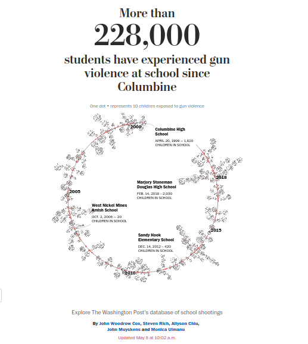

```{r setup, include=FALSE}
knitr::opts_chunk$set(echo = TRUE)
```

 
[The Washington Post School Shootings](https://www.washingtonpost.com/graphics/2018/local/school-shootings-database/)

> School shootings are horrific events. By 2018 the Post counted 144 children, teachers and others killed in school assaults and 302 physically injured.  All present, however, suffer trauma. Using school enrollment, the Post tallied 228,000 children at 234 school incidents.

## What of the other victims?
> Fortunately, school shootings are rare events. Many children, however, live in proximity to homicidal violence.  This is rarely newsworthy.  
  
> Mimicking the Post, I set out to count the homicides occuring within 1/4 mile of a school and, using school enrollments, estimating the number of students affected.  This involved joining three datasets:

1. [**The Washington Post's Homicide Database**](https://github.com/washingtonpost/data-homicides)
spans over 52,000 homicides across the U.S. between January 1, 2007 and December 31, 2015.  Each record provides, among other items, the victim's age and ethnicity, the date the crime was reported and the geocoordinates where the victim was found.
2. [**Education Demographic and Geographic Estimates (EDGE) Geocodes**](http://data-nces.opendata.arcgis.com/datasets/public-school-locations-2017-18/data)
provides the geocoordinates and census identifiers of more than 102,000 U.S. public schools and agencies.
3. [**National Center for Education Statistics**](https://nces.ed.gov/ccd/schoolsearch/index.asp)
 gives state by state each public school's enrollment, the number of teachers, and the number of students receiving free or reduced price lunches.
 4. [**The Washington Post's database of school shootings in the United States since Columbine.](https://github.com/washingtonpost/data-school-shootings)
 provides a variety of data about each shooting as well as the schools at which they occurred.
 
```{r}
# load libraries
library(tidyverse)
library(geosphere)
```
## Pre-process schoolMoreInfo datasets
## ```{r}  
library(readxl)
setwd("nces")  
### collect the xls files  
ncesList<-system("ls *.xls",intern=TRUE)  
nces<-tibble()  
#  
# get each nces.xls as tibble, bind them to nces tibble  
#  
for ( i in ncesList) {  
  t<-read_xls(i,skip=19)  
  nces<-rbind(nces,t)    
}  
  
write_csv(nces,"nces.csv")  

## ```  

## Parameters:

```{r}

param<-list()
param$halfBoxDistance<-402.336 # distance to side of bounding box enclosing homicide. Used to find schools inside box
param$homicideUrl="https://github.com/sdutky/mcData110/raw/master/otherVictims/homicide-data.csv"
param$schoolUrl="https://github.com/sdutky/mcData110/raw/master/otherVictims/public-school-locations-2017-18.csv"
param$schoolMoreInfUrl="https://github.com/sdutky/mcData110/raw/master/otherVictims/nces.csv"
param$stateBboxUrl="https://gist.githubusercontent.com/a8dx/2340f9527af64f8ef8439366de981168/raw/81d876daea10eab5c2675811c39bcd18a79a9212/US_State_Bounding_Boxes.csv"
```


## load, view, clean, & prep homicide dataset

```{r}
library(tidyverse)
hom<-read_csv(param$homicideUrl)

hom$victim_age<-as.numeric(hom$victim_age)
#str(hom)
#summary(hom)

# drop rows where either lat or lon is NA
hom<-hom %>%
  drop_na(lat,lon)
         
summary(hom)
a<-seq_along(hom$state)[hom$state=="wI"]
hom$state[a]="WI"
print(sort(unique(hom$state)))
```

## filter homicide rows where lat,lon lie outside of the bounding boxes of their respective states

```{r}
bb<-read_csv(param$stateBboxUrl)
names(bb)[3]<-"state"
bb<-bb[,c("state","xmin","xmax","ymin","ymax")]
summary(hom) # get snapshot before
hom<- hom %>%
  inner_join(bb,by="state") 
hom<- hom %>%
  filter(!(lat<=xmax & lat>=xmin & lon<=ymax & lon>=ymin))
summary(hom) # and after to compare to before

# drop xmin,xmax,ymin,ymax:
hom<-hom %>% select(-c(xmin,xmax,ymin,ymax))

```
## Identify all schools located within 1/2 mile of a homicide

```{r}
bBox<-function(lat,lon,threshold=param$halfBoxDistance) {
  # return list of mid-point lats & lons of bounding box
  
  # determine the meter distance of 1 degree at location
  dLon<-function(lon,lat) distGeo(c(lon,lat),c(lon+1,lat))
  dLat<-function(lon,lat) distGeo(c(lon,lat),c(lon,lat+1))
  
  dlon<-mapply(dLon, lon, lat)
  dlat<-mapply(dLat, lon, lat)
  
  dueEast<-lon+threshold/dlon
  dueWest<-lon-threshold/dlon
  dueNorth<-lat+threshold/dlat
  dueSouth<-lat-threshold/dlat
  return(tibble(dueEast=dueEast,dueWest=dueWest,
                dueSouth=dueSouth,dueNorth=dueNorth))
}
```

## generate the bonding boxes enclosing each homicide and bind it to the homicide tibble

```{r}
boxes<-bBox(hom$lat,hom$lon)
hom<-cbind(hom,boxes)
```
## fetch and clean the geocoded school datasent

```{r}
#geoSchools<-read_csv(param$schoolUrl)
names(geoSchools)<-tolower(names(geoSchools))
```

## Original Sources
[Bounding Boxes for States](https://anthonylouisdagostino.com/bounding-boxes-for-all-us-states/)

## Determine the distributions of the distances of these schools from the homicides
## perform joins to identify #students, student/teacher ratio, free lunch counts of these schools.
## compare to all schools.
## estimate number of students enrolled affected by homicides
